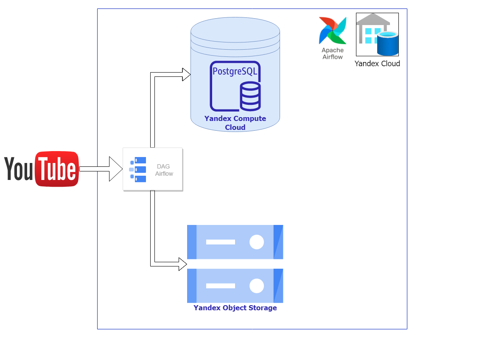
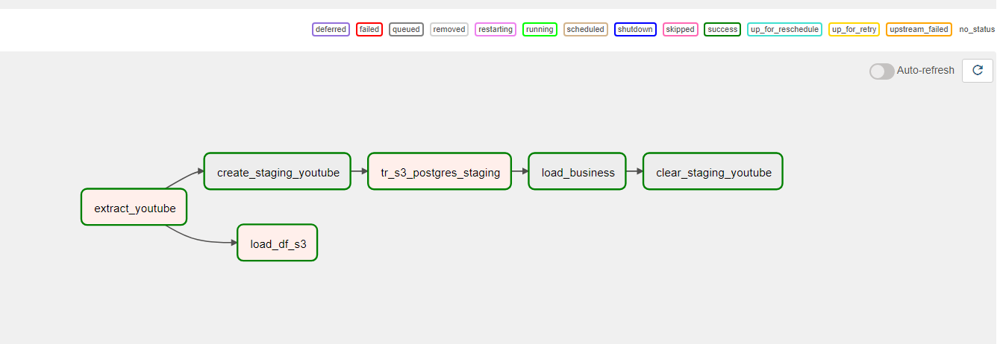
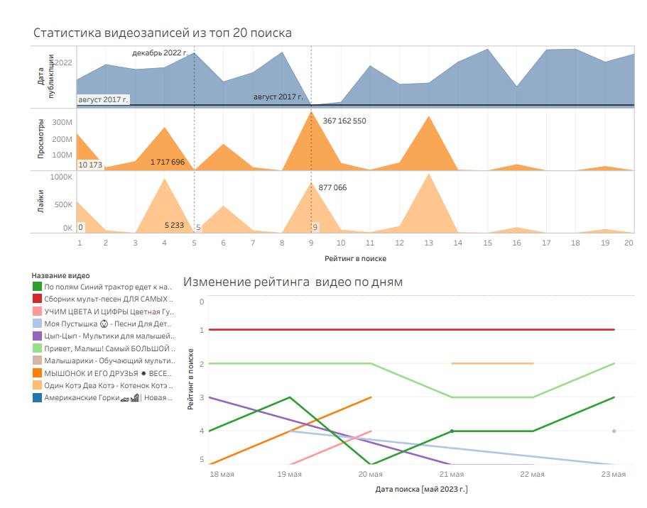
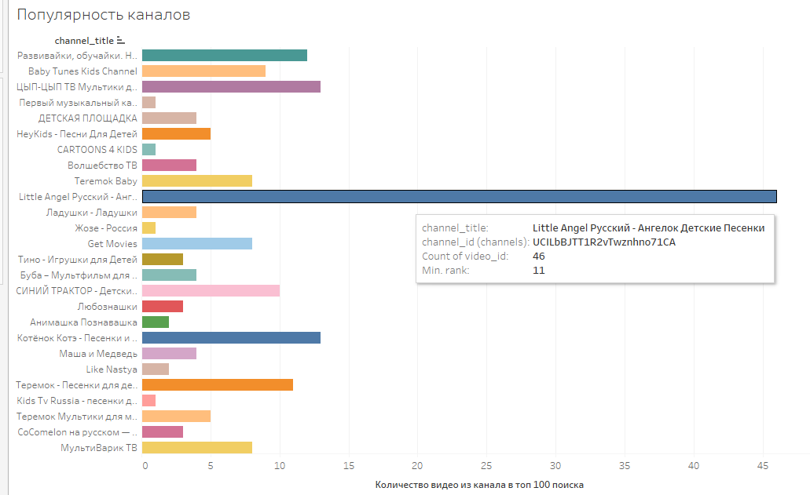

# Youtube project
**📊  Analysis youtube search algorithm**
## Architectural solution

## Plan:
- [Idea](#idea)
- [Goals](#goals)
- [Stack](#stack-used)
## Realization:
- [Preparation](#preparation)
- [Extract Data](#extract-from-youtube)
- [Transform-Load](#transform-and-load)
- [Analysis](#analysis)
- [Conclusion](#conclusion)
## Plan
### Idea
Find the relationship between search rank and video attributes. Analyze search ranking day by day. It's useful for content creation.
I will analyze kid's content because it is one of the most popular and viewed segments on YouTube.
### Goals
- Extract data from YouTube
- Load Data set to warehouse
- Clean and optimize Data set for analysis
- Load Data set to DB (staging --> business)
- Analysis Data set
### Stack used
- Yandex Cloud platform: 
```Virtual Private Cloud, Compute Cloud, Object Storage(S3)``` 
- Airflow
- Postgres DB
- Tableau
- Docker
- Google API
- Python, SQL
---
## Realization
### Preparation
- Deploy Virtual Machine (CPU2, RAM 8Gb, HDD 50Gb) in Compute Cloud with [Docker containers](/docker) for Airflow and Postgres (not metadata store).
- Create S3 bucket in Object Storage.
- Create connections
- Check the data to be used
- Create schemas and tables. I've defined [DAG](dag_create_tables_youtube.py) to create 2 schema with 3 tables (one is staging and two are business))
### Extract from YouTube
I've decided to use the [Google API](https://developers.google.com/youtube/v3/docs/search/list) in PythonOperator to extract information from search results with request: "мультики для малышей". There are two methods which I've used search.list() and videos.list(). With these methods, I was able to extract the following information:
```csv
date_extract, video_id, title, description, view_count, like_count,comment_count, time_published, channel_id, channel_title
```
The task 'extract_youtube' in the [DAG](dag_youtube_s3_pd.py)

### Transform and Load
Then I've defined 2 parallel tasks:
- One load data without transformation to wharehouse, using PythonOperator in task:
```python
def load_df_s3(**context):
    s3_conn = S3Hook(aws_conn_id='s3')
    df = context['ti'].xcom_pull(task_ids='extract_youtube', key='youtube_df')
    csv_data = df.to_csv(index=False)
    file_name = f'youtube_extract_{context["ds"]}.csv'
    s3_conn.load_string(csv_data, key=file_name, bucket_name='youtube-analytics', replace=True)
    context['ti'].xcom_push(key='file_name', value=file_name)
```
- One transfer data for analyze and load it into Postgres ([DAG](dag_youtube_s3_pd.py)).

After that, I've defined another task to transport data from staging to business schema in Postgres DB, using PostgresOperator:
```python
t4 = PostgresOperator(task_id='load_business',
                      postgres_conn_id='postgres',
                      sql='''
                    INSERT INTO business.channels
                    SELECT DISTINCT(channel_id), channel_title
                    FROM public.youtube
                    WHERE channel_id NOT IN (SELECT channel_id
                                            FROM business.channels)
                    ON CONFLICT DO NOTHING;

                    INSERT INTO business.videos
                    SELECT rank, date_extract, video_id, title, description, view_count, like_count, comment_count, time_published, channel_id
                    FROM public.youtube;
                    ''')
```


Then I've cleaned staging table.
### Analysis

The popularity of channels from the top 100 search, sort by rank:

### Conclusion
The position in the search results depends on several parameters, the most important of which are the views and publication of the data.
Parameter importance alternates in search. The first video has high view rates and was posted relatively recently. Then the second video has low views count and was posted long time ago. On the other hand, the third video received more views than the second, but was published earlier.

The position in the search does not depend on the views of the channel. The video of the most viewed channel is at 336th place.
The channel which has the most videos in top 100 of the search is at 11th place and has 46 videos in the search, while the first video's channel has 11 videos in the search
