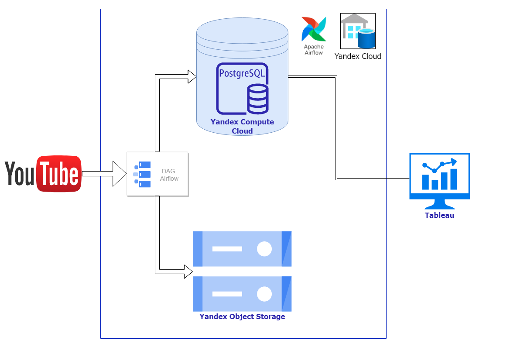

# Youtube project
**📊  Analysis youtube search algorithm**
## Architectural solution
## Plan:
- [Idea](#idea)
- [Goals](#goals)
- [Stack](#stack-used)
## Realization:
- [Extract Data](#extract-data)
- [Transform-Load](#transform-load)
- [Analysis](#analysis)
- [Counclusion](#conclusion)

### Idea
Find the relationship between search rank and video attributes and analyze search ranking day by day. It's useful for content creation.
### Goals
- Extract data from YouTube
- Clean and Optimazy Data set for analysis
- Load Data set to wharehouse
- Load Data set to DB (staging --> business)
- Analysis Data set

### Stack used
- Yandex Cloud platform: 
```Virtual Private Cloud, Compute Cloud, Object Storage(S3)``` 
- Airflow
- Postgres DB
- Tableau
- Google API
- Python, SQL




